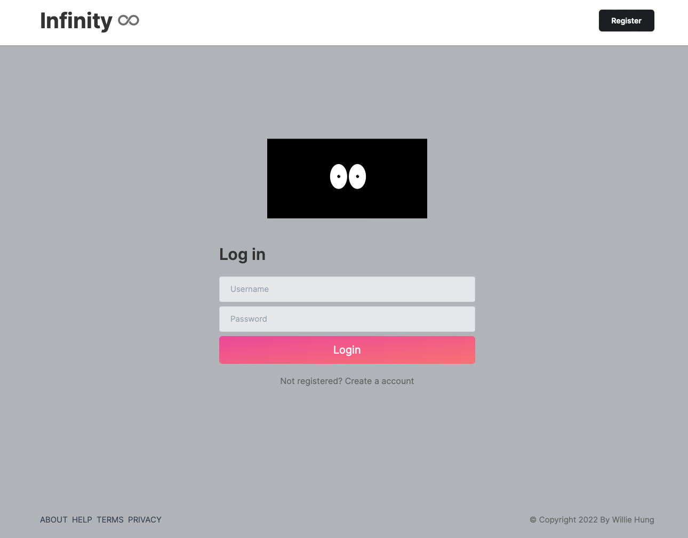
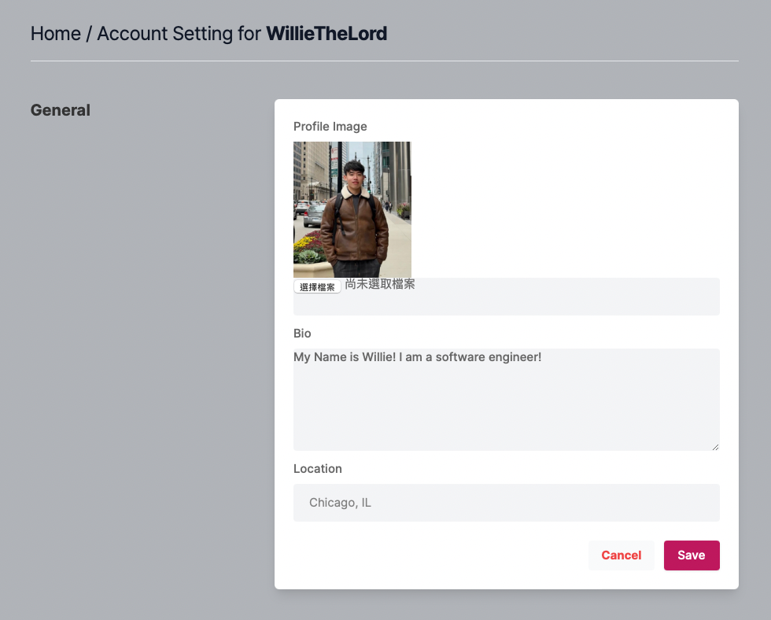
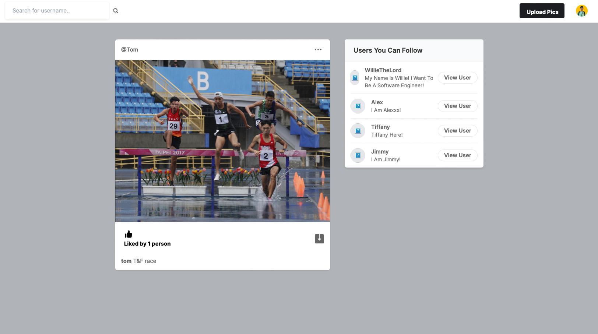
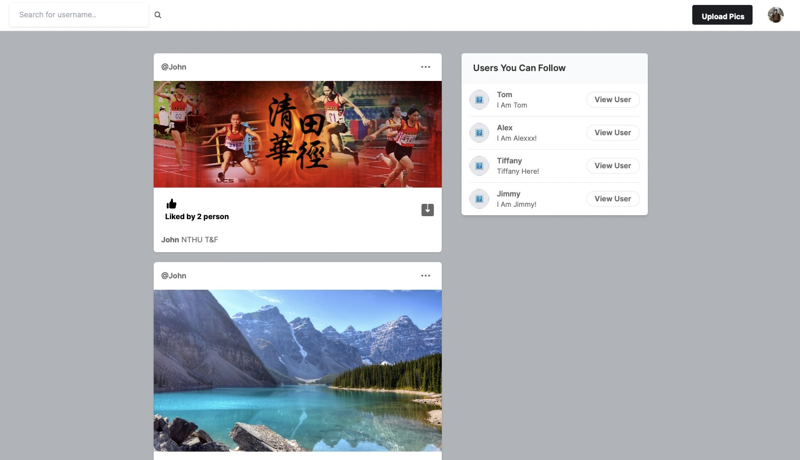
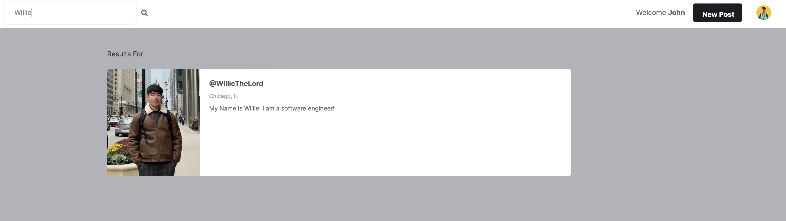

<h1 align="center">Infinity</h1>

## About
An Instagram-like social media application using ```Django``` that allows multi-users to create their own profile, upload/download photos, follow other users and share their own lives. 

## Overview



## Prerequisites
- ```Python``` >= 3.6
- ```Django``` >= 3.0
  - You can either install ```Django``` by ```pip```, ```poetry```( recommended ), etc...
  - pip: https://www.djangoproject.com/download/
  - poetry: https://rasulkireev.com/managing-django-with-poetry/

## How to run
- Navigate to the directory 
``` bash
 cd /Users/[UserName]/Documents/GitHub/Social-Media-App/MySocialMediaApp/my_social_media
```
- Run the server
``` bash
 python manage.py runserver
```
- Open up your browser and the progam will be running on your local server ```http://127.0.0.1:8000/```

## Get started
- First, Create your own account  with your ```Username```, ```Email``` and ```Password```.
- Second, You can see ```Users You Can Follow``` bar beside the feed / timeline.
- Third, check out the users using ```Infinity```. You can follow them and view their profile to learn more.
- Fourth, as soon as you start following other users, you can see their ```posts``` on the timeline.
- Fifth, always feel free to upload your own ```photos```, download others ```photos``` and give a ```kudos``` on other's post.
- Last but not least, enjoy ```Infinity``` and play around with it!

## Feature
### Set your own profile
  **Description**: You can edit your personal account setting by uploading your ```Profile Image```, ```Bio```, and  ```Location```

  
  
### Upload post
  **Description**: You can post photos and comments on ```Infinity``` using the ```upload pics``` button

  

### Browse feed / timeline
**Description**: When you start following people on ```Infinity```, you can see posts popping on your timeline. Now you can like or download other's posts when you are browsing the timeline. There is also a suggestion bar ```Users You Can Follow``` that recommends people who uses ```Infinity```

  

### Browse other user's profile
**Description**: Click on the suggestion bar's ```View User``` button, you will be navigated to other user's profile page and see their ```Info``` and ```Posts```


### Search other user's profile
**Description**: ```Infinity``` supports searching feature, you can type any keywords you want to search and get the result of it which is really convenient for searching other's profile




## Acknowledgements
Great thanks to [Tomi Tokko](https://github.com/tomitokko)'s Python Django social media application information. This project really improves my overall Django concepts and knowledge. To be more specific, the Model-View-Controller(MVC) structure and how modern application should look like. Building this app with much joy!


